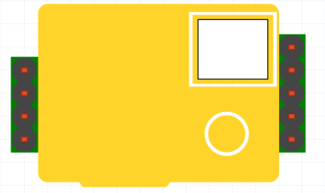

# fritzing-parts

This repository contains parts for the Fritzing application. Just download the .fzpz file and drag it into fritzing

Where applicable, both the breadboard and the silkscreen are designed.

This repository started as a fork from [Daniel Eichhorn (Squix78)](https://github.com/squix78), the author of many fine projects like the OLED display library.
Some of his Fritzing parts, I made improvements on, but I also added some myself. Where I used his Fritzing parts, I left his credentials in the Fritzing parts.

## Available parts
   * [NodeMCU V1.0](#nodemcu-v10)
   * [LuaNode32 ESP32](#luanode32-esp32)
   * [OLED SSD1306 0.96" 128x64 displays](#oled-ssd1306-096-128x64-displays)
   * [OLED SSD1306 0.91" 128x32 display](#oled-ssd1306-091-128x32-display)
   * [OLED SSH1106 1.3" 128x64 display](#oled-ssh1106-13-128x64-display)
   * [MH-Z19 CO2 sensor](#mh-z19-co2-sensor)

### NodeMCU V1.0
[NodeMCU V1.0](https://github.com/squix78/esp8266-fritzing-parts/blob/master/nodemcu-v1.0/NodeMCUV1.0.fzpz): this is the second incarnation of the ESP8266 based dev board. You can find it on [AliExpress]( http://s.click.aliexpress.com/e/QbUnuvrVV) 

Read more about it [on my blog](http://blog.squix.ch/2015/05/esp8266-nodemcu-v10-part-created-for.html).

### LuaNode32 ESP32
There are numerous boards for the ESP32.
This is one of them.

   * [Author of the board](https://github.com/Nicholas3388/LuaNode)
   * Available on [Banggood](https://www.banggood.com/ESP32-Development-Board-WiFiBluetooth-Ultra-Low-Power-Consumption-Dual-Cores-ESP-32-ESP-32S-Board-p-1109512.html?p=1712161907732201507C) (affiliate link)
   * [Datasheet ESP32](http://espressif.com/sites/default/files/documentation/esp-wroom-32_datasheet_en.pdf)

   

### OLED SSD1306 0.96" 128x64 displays
There are two versions of these displays, with only the GND and VCC swapped.

   * GND-VCC-SCL-SDA version available on [Banggood](https://www.banggood.com/5Pcs-0_96-Inch-4Pin-White-IIC-I2C-OLED-Display-Module-For-Arduino-p-971295.html?p=1712161907732201507C) (affiliate link)

 

  

### OLED SSD1306 0.91" 128x32 display
The 0.91" displays are quite small and only show 32 pixels height.

These display only every other line, so they remain compatible with the existing libraries for the 128x64 displays.

   * Available on Banggood [Blue](https://www.banggood.com/0_91-Inch-128x32-IIC-I2C-Blue-OLED-LCD-Display-DIY-Oled-Module-SSD1306-Driver-IC-DC-3_3V-5V-p-1140506.html?p=1712161907732201507C) or [White](https://www.banggood.com/0_91-Inch-OLED-Display-Module-12832-LCD-Screen-IIC-I2C-Serial-Port-For-Arduino-p-1145084.html?p=1712161907732201507C) (affiliated links)

### OLED SSH1106 1.3" 128x64 display
The larger 1.3" OLED monochrome displays use the SSH1106 chip.

   * Available on [Banggood](https://www.banggood.com/1_3-Inch-4Pin-White-OLED-LCD-Display-12864-IIC-I2C-Interface-Module-For-Arduino-p-1067874.html?p=1712161907732201507C) (affiliate link)

 

### MH-Z19 CO2 sensor
The [MH-Z19](http://www.winsen-sensor.com/products/ndir-co2-sensor/mh-z19.html) and the [MH-Z19B](http://www.winsen-sensor.com/products/ndir-co2-sensor/mh-z19b.html) are quite affordable CO2 sensors.

These are pin-out compatible (not software compatible) with the [Senseair S8 CO2 sensor](http://www.senseair.com/products/oem-modules/senseair-s8/) 

The S8 has its air intake at the bottom. 
For this purpose the air intake opening of the S8 sensor is also drawn in the silk screen to make it easier to add an opening in the PCB.

   * MH-Z19 CO2 sensor on [Banggood](https://www.banggood.com/MH-Z19-0-5000PPM-Infrared-CO2-Sensor-For-CO2-Indoor-Air-Quality-Monitor-UARTPWM-p-1094463.html?p=1712161907732201507C) (affiliate link)
   * Senseair S8 CO2 sensor available on [AliExpress](https://www.aliexpress.com/wholesale?catId=0&initiative_id=SB_20170920113528&SearchText=senseair+s8)
   
 
